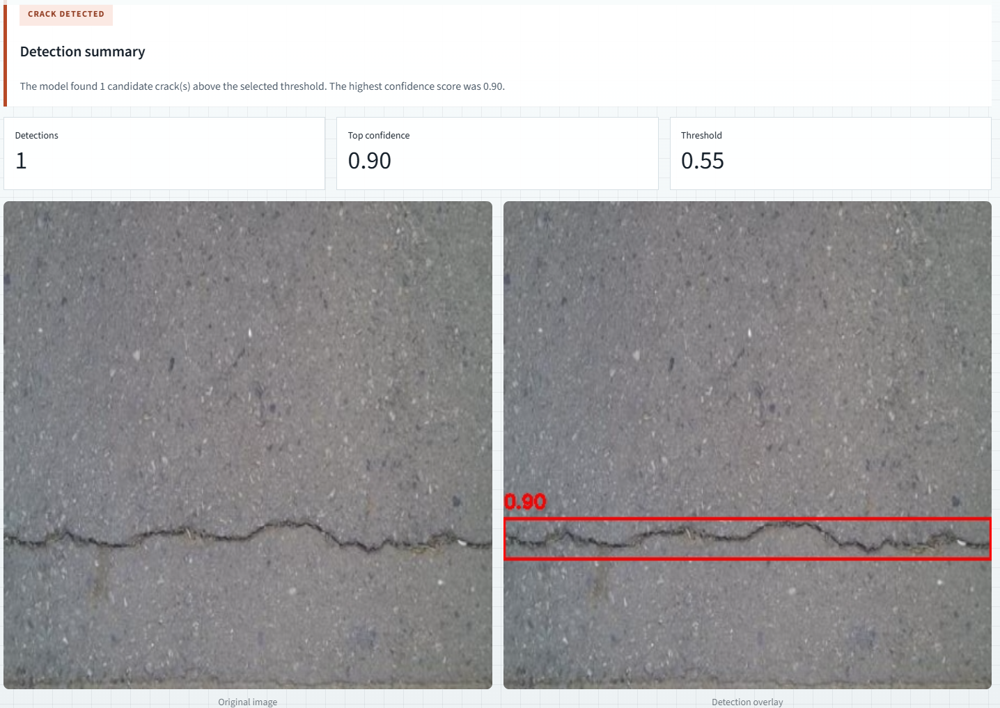
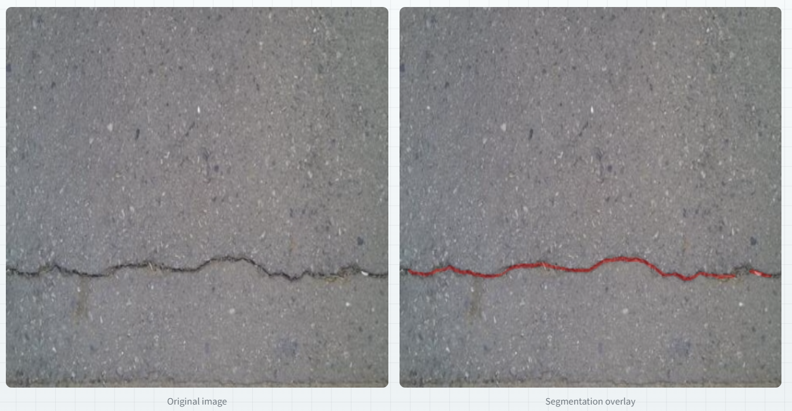
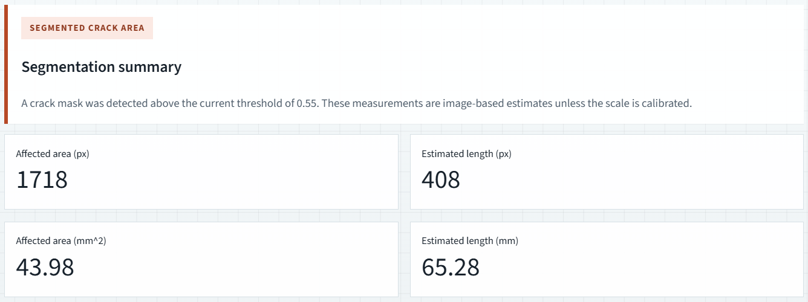

# Crack Detection

[](LICENSE)
[](https://huggingface.co/spaces/marcoslsantos/crack-detection)

> Image-based crack detection on concrete/pavement surfaces: **Faster R-CNN** localises cracks with bounding boxes, **UNet++** segments them pixel-by-pixel and estimates area and length. Two PyTorch models behind one Streamlit UI and one FastAPI service.

**▶ Try it live (no install):** **https://huggingface.co/spaces/marcoslsantos/crack-detection**

---

## The problem

Cracks are early indicators of structural deterioration in roads, bridges and buildings. Manual visual inspection is slow, subjective, and hard to scale across kilometres of surface. Automating *where* a crack is (localisation) and *how large* it is (area/length) makes inspection faster and more consistent, and produces measurements you can track over time. This repo is a compact, runnable demo of that idea.

## Approach

Two complementary models, each suited to a different question:

| Model | Question it answers | Output |
|-------|--------------------|--------|
| **Faster R-CNN** (`fasterrcnn_resnet50_fpn`, 2 classes) | *Is there a crack, and where?* | Bounding boxes + confidence scores |
| **UNet++** (`segmentation_models_pytorch`, ResNet-34 encoder, 1 class) | *What is its exact shape and size?* | Binary mask + area (px) and length (px), optionally mm |

**Architecture note.** Detection runs at the image's native resolution; segmentation resizes input to **512×512**, applies a sigmoid + threshold to get a binary mask, then estimates crack length from the mask **skeleton** (`skimage.skeletonize`). Both entrypoints — the Streamlit UI (`streamlit_app.py`) and the FastAPI service (`app.py`) — share one preprocessing and inference path (`inference_utils.py`, `model_utils.py`), so the API and UI always produce identical results. Device is auto-selected (CUDA if available, else CPU) and can be forced with the `CRACK_DETECTION_DEVICE` env var.

## Results

> **Honesty note:** This repository is an **inference/demo app only**. It does **not** include the training code, dataset, or an evaluation script, so the headline accuracy figures (detection precision/recall/F1, segmentation IoU/Dice) **cannot be reproduced from a command in this repo.**

What you *can* verify directly, from the live demo or locally:

- **Detection** draws a labelled bounding box with a confidence score around each crack and reports a detection count (see below).
- **Segmentation** produces a red mask overlay and reports affected area and estimated length in pixels, convertible to millimetres when you supply a scale factor.

### Sample predictions

**Detection — Faster R-CNN** (1 crack found, confidence 0.90, threshold 0.55):



**Segmentation — UNet++** (original vs. predicted crack mask):



**Segmentation measurements** (area and length in px, with optional mm conversion):



## Reproduce it

Tested with **Python 3.12**. Dependencies are pinned in `requirements.txt`.

```bash
# 1. Clone
git clone https://github.com/marcoslopezs/crack-detection.git
cd crack-detection

# 2. Fetch model weights (tracked with Git LFS — required, or model loading fails)
git lfs install
git lfs pull

# 3. Install
python -m venv venv
# Windows:  venv\Scripts\activate
# Linux/macOS:  source venv/bin/activate
pip install -r requirements.txt
```

**Run the Streamlit demo:**

```bash
streamlit run streamlit_app.py
```

**Run the API** (interactive docs at `http://127.0.0.1:8000/docs`):

```bash
uvicorn app:app --reload
```

**Run the tests** (CPU-only, models are mocked, runs in seconds):

```bash
python -m unittest discover -s tests
```

> The `.pth` weights live in `weights/` via Git LFS. If you cloned without LFS, you'll see pointer stubs instead of real files and `load_project_models` will raise `FileNotFoundError` — run `git lfs pull` to fix it.

## Design decisions & tradeoffs

- **Two specialised models instead of one multitask model.** Detection gives a fast yes/no + count + location; segmentation gives precise shape and measurements. Keeping them separate makes each simpler to reason about and swap.
- **One shared inference path for UI and API.** Preprocessing and postprocessing live in `inference_utils.py` / `model_utils.py`, not in the entrypoints, so the two interfaces can't silently drift apart.
- **Fixed 512×512 segmentation input.** A speed/memory tradeoff that keeps CPU inference tractable; the mask is resized back to the original resolution before measuring.
- **Pixels first, millimetres only on request.** Measurements are reported in pixels by default; physical units require a user-supplied scale (mm/px), so the app never implies a calibration it doesn't have.
- **CPU-friendly by default** (`opencv-python-headless`, auto CPU fallback, `weights_only=True` loading) so it deploys cleanly to Hugging Face Spaces and runs without a GPU.

## Limitations

- Segmentation area/length are **image-based estimates**; the millimetre values are only physically meaningful with a reliable scale factor.
- Crack length is approximated from the mask skeleton (pixel count), which is a rough proxy, not a geodesic measurement.
- CPU inference is slower, especially on the first request while the models load.
- The models were trained for a specific crack-detection task; accuracy can drop on very different surfaces, lighting, or acquisition conditions (domain shift).
- No training or evaluation code is included here — see the honesty note under [Results](#results).

## Repository layout

```text
crack-detection/
├── app.py                  # FastAPI backend (predict + /health endpoints)
├── streamlit_app.py        # Streamlit interface
├── inference_utils.py      # device, preprocessing, model loading (shared)
├── model_loader.py         # PyTorch model definitions + weight loading
├── model_utils.py          # detection filtering & segmentation metrics
├── tests/                  # unittest smoke/unit tests (models mocked)
├── weights/                # trained .pth weights (Git LFS)
├── docs/screenshots/       # demo screenshots used in this README
└── requirements.txt        # pinned dependency versions
```

## License

MIT. See [LICENSE](LICENSE).
